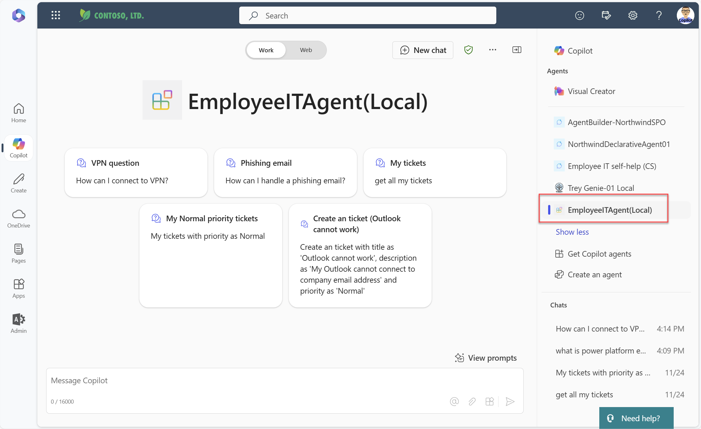

# Employee IT Agent

## Overview
Employee IT Agent is a declarative agent to showcase how a Copilot agent can provide answers and perform actions based on the end users’ questions. 
Employee IT Agent connected to the following data sources: 
* ServiceNow MS Graph connector to provide answers for IT related questions
* A SPO document library stored a Power Platform environment document and a Power Platform licensing document which provides answers for Power Platform related questions. 
* API Plugins which connected to a ticket service API to retrieve the user’s ticket information and create a ticket. 

Employee IT Agent behave like a IT agent and can answer the end users’ IT or Power Platform questions. If the agent cannot answer the questions from those knowledges, it will suggest creating a support case. The agent is able to list the end users’ ticket information based on various filters like ticket’s Priority, Status and Title. 

## Setup
### Prerequisites
* [Visual Studio Code](https://code.visualstudio.com/Download)
* [NodeJS 18.x](https://nodejs.org/en/download)
* [Teams Toolkit extension for VS Code](https://marketplace.visualstudio.com/items?itemName=TeamsDevApp.ms-teams-vscode-extension)
  NOTE: If you want to build new projects of this nature, you'll need Teams Toolkit v5.6.1-alpha.039039fab.0 or newer
* [Teams Toolkit CLI](https://learn.microsoft.com/microsoftteams/platform/toolkit/teams-toolkit-cli?pivots=version-three)
  (`npm install -g @microsoft/teamsapp-cli`)
* (optional) [Postman](https://www.postman.com/downloads/)

### Setup instructions (one-time setup)

1. Log into Teams Toolkit using the tenant where you will run the sample.

2. If your project doesn't yet have a file **env/.env.local.user**, then create one by copying **env/.env.local.user.sample**. If you do have such a file, ensure it includes these lines.

~~~text
SECRET_STORAGE_ACCOUNT_CONNECTION_STRING=UseDevelopmentStorage=true
~~~

3. Create a ServiceNow MS Graph Connector and update the ```connection_id``` to ServiceNow MS Graph Connector id. you can refer to [Retrieving capabilities IDs for declarative agent manifest](https://learn.microsoft.com/en-us/microsoft-365-copilot/extensibility/declarative-agent-capabilities-ids?tabs=explorer) for how to get capability Id for a declarative agent.
```
{
    "name": "GraphConnectors",
    "connections": [
        {
            "connection_id": "ServiceNowKB3"
        }
    ]
}
```
4. Create a SPO site collection and a document library. Copy the files from the **/sampleDocs** folder to the document library. Add the document library's location  in the `OneDriveAndSharePoint` capability in the declarative copilot (**/appPackage/declarativeAgent.json**).
```JSON
{
    "name": "OneDriveAndSharePoint",
    "items_by_url": [
        {
            "url": "https://[spo-document-library-url]"
        }
    ]
}
```

### Running the solution

1. Press F5 to start the application. It will take a while on first run to download the dependencies. Eventually a browser window will open up and your package is installed.

2. Navigate to Copilot as shown below


3. Access the declarative agent by opening the flyout, then select the "EmployeeITAgent(Local)".


## What's included in the template

| Folder       | Contents                                                                                    |
| ------------ | ------------------------------------------------------------------------------------------- |
| `.vscode`    | VSCode files for debugging                                                                  |
| `appPackage` | Templates for the Teams application manifest, the plugin manifest and the API specification |
| `env`        | Environment files                                                                           |
| `infra`      | Templates for provisioning Azure resources                                                  |
| `src`        | The source code for the repair API                                                          |

The following files can be customized and demonstrate an example implementation to get you started.

| File                                         | Contents                                                                                          |
| -------------------------------------------- | ------------------------------------------------------------------------------------------------- |
| `src/functions/repairs.ts`                   | The main file of a function in Azure Functions.                                                   |
| `src/repairsData.json`                       | The data source for the repair API.                                                               |
| `appPackage/apiSpecificationFile/repair.yml` | A file that describes the structure and behavior of the repair API.                               |
| `appPackage/manifest.json`                   | Teams application manifest that defines metadata for your plugin inside Microsoft Teams.          |
| `appPackage/ai-plugin.json`                  | The manifest file for your API Plugin that contains information for your API and used by LLM. |
| `appPackage/repairDeclarativeAgent.json` | Define the behaviour and configurations of the declarative agent. |

The following are Teams Toolkit specific project files. You can [visit a complete guide on Github](https://github.com/OfficeDev/TeamsFx/wiki/Teams-Toolkit-Visual-Studio-Code-v5-Guide#overview) to understand how Teams Toolkit works.

| File                 | Contents                                                                                                                                  |
| -------------------- | ----------------------------------------------------------------------------------------------------------------------------------------- |
| `teamsapp.yml`       | This is the main Teams Toolkit project file. The project file defines two primary things: Properties and configuration Stage definitions. |
| `teamsapp.local.yml` | This overrides `teamsapp.yml` with actions that enable local execution and debugging.                                                     |

## Addition information and references

- [Declarative agents for Microsoft 365](https://aka.ms/teams-toolkit-declarative-agent)
- [Extend Microsoft 365 Copilot](https://aka.ms/teamsfx-copilot-plugin)
- [Message extensions for Microsoft 365 Copilot](https://learn.microsoft.com/microsoft-365-copilot/extensibility/overview-message-extension-bot)
- [Microsoft Graph Connectors for Microsoft 365 Copilot](https://learn.microsoft.com/microsoft-365-copilot/extensibility/overview-graph-connector)
- [Microsoft 365 Copilot extensibility samples](https://learn.microsoft.com/microsoft-365-copilot/extensibility/samples)
