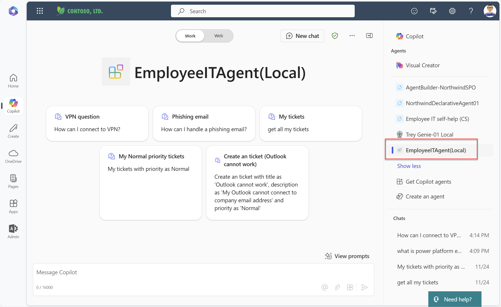

# Employee IT Agent

## Overview
Employee IT Agent is a declarative agent to showcase how a Copilot agent can provide answers and perform actions based on the end users’ questions. 
Employee IT Agent connected to the following data sources: 
* ServiceNow MS Graph connector to provide answers for IT related questions
* A SPO document library stored a Power Platform environment document and a Power Platform licensing document which provides answers for Power Platform related questions. 
* API Plugins which connected to a ticket service API to retrieve the user’s ticket information and create a ticket. 

Employee IT Agent behave like a IT agent and can answer the end users’ IT or Power Platform questions. If the agent cannot answer the questions from those knowledges, it will suggest creating a support case. The agent is able to list the end users’ ticket information based on various filters like ticket’s Priority, Status and Title. 

## Setup
### Prerequisites
* [Visual Studio Code](https://code.visualstudio.com/Download)
* [NodeJS 18.x](https://nodejs.org/en/download)
* [Teams Toolkit extension for VS Code](https://marketplace.visualstudio.com/items?itemName=TeamsDevApp.ms-teams-vscode-extension)
  NOTE: If you want to build new projects of this nature, you'll need Teams Toolkit v5.6.1-alpha.039039fab.0 or newer
* [Teams Toolkit CLI](https://learn.microsoft.com/microsoftteams/platform/toolkit/teams-toolkit-cli?pivots=version-three)
  (`npm install -g @microsoft/teamsapp-cli`)
* (optional) [Postman](https://www.postman.com/downloads/)

### Setup instructions (one-time setup)

1. Log into Teams Toolkit using the tenant where you will run the sample.

2. If your project doesn't yet have a file **env/.env.local.user**, then create one by copying **env/.env.local.user.sample**. If you do have such a file, ensure it includes these lines.

~~~text
SECRET_STORAGE_ACCOUNT_CONNECTION_STRING=UseDevelopmentStorage=true
~~~

3. Create a ServiceNow MS Graph Connector and update the ```connection_id``` to ServiceNow MS Graph Connector id. you can refer to [Retrieving capabilities IDs for declarative agent manifest](https://learn.microsoft.com/en-us/microsoft-365-copilot/extensibility/declarative-agent-capabilities-ids?tabs=explorer) for how to get capability Id for a declarative agent.
```
{
    "name": "GraphConnectors",
    "connections": [
        {
            "connection_id": "ServiceNowKB3"
        }
    ]
}
```
4. Create a SPO site collection and a document library. Copy the files from the **/sampleDocs** folder to the document library. Add the document library's location  in the `OneDriveAndSharePoint` capability in the declarative copilot (**/appPackage/declarativeAgent.json**).
```JSON
{
    "name": "OneDriveAndSharePoint",
    "items_by_url": [
        {
            "url": "https://[spo-document-library-url]"
        }
    ]
}
```

### Running the solution

1. Press F5 to start the application. It will take a while on first run to download the dependencies. Eventually a browser window will open up and your package is installed.

2. Navigate to Copilot as shown below


3. Access the declarative agent by opening the flyout, then select the "EmployeeITAgent(Local)".

## API Summary
EmployeeITAgent sample included a Tickets API which wrapped up as a Azure Function. 

### GET request
```javascript
GET /api/me/tickets - get my tickets information
GET /api/me/tickets?status=open&priority=normal - get my tickets with status is open and priority is normal
GET /api/me/tickets?title=vpn&status=open&priority=normal - get my tickets where title contains "vpn", status is open and priority is normal. 
```

### POST request
```javascript
POST /api/me/tickets - Add a new ticket
Request body:
{
    "title": "VPN doesn't work",
    "description": "VPN doesn't work",
    "priority": "Normal"
}
Response body:
{
    result:{
        "id": "fb0e25a8-2fe7-4a2b-8406-fa5f474d2f67",
        "title": "VPN doesn't work",
        "description": "VPN doesn't work",
        "priority": "Normal",
        "assignee": "KaiC@M365CPI78904853.OnMicrosoft.com",
        "creationDate": "2024-11-07T00:00:00Z",
        "updateDate": "2024-11-11T00:00:00Z",
        "status": "Open",
        "url": "https://ldkv4tjn-7071.usw2.devtunnels.ms/api/me/tickets/fb0e25a8-2fe7-4a2b-8406-fa5f474d2f67"
    }
}
```

## Troubleshooting
When created ticket, you might see "Sorry, I can't chat about this. To save the chat and start a fresh one, select New Chat" error message. it might be caused by a issue that ticket information you provided didn't pass the RAI validation. You can leverage the below prompt to generate test ticket contents which shouldn't violate the RAI rules from Copilot Bizchat. 
```
you are IT support agent and trying to create some test support ticket information. the information should included ticket title, description and those information should comply Responsible AI (RAI) guideline to ensure the content doesn't violate RAI rules. please create 5 test support tickets.
```

the following test prompts also worked: 
```
Add a support ticket with the following information: 
title: Issue with Cloud Storage Access 
description: User reports difficulty accessing cloud storage. The system prompts an error message stating "Access Denied" despite having the correct permissions. Please investigate and resolve the access issue.
priority:Low

Add a support ticket with the following information: 
title: Slow Network Performance 
description: User experiences slow network performance when accessing company resources remotely. The issue persists across different devices and locations. Please analyze the network logs and identify the root cause of the slowdown.
priority:Low

Add a support ticket with the following information: 
title: Software Installation Failure 
description: User is unable to install the latest version of the CRM software. The installation process halts with an error code 0x80070005. Please assist in troubleshooting the installation issue and ensure the software is correctly installed.
priority:Low

Add a support ticket with the following information: 
title: Email Synchronization Problem 
description: User's email client is not synchronizing with the server. Emails are not being sent or received, and the client displays a "Sync Error" message. Please check the email server settings and resolve the synchronization issue.
priority:Low

Add a support ticket with the following information: 
title: Printer Connectivity Issue 
description: User reports that the office printer is not connecting to the network. The printer displays a "Network Unavailable" message, and users are unable to print documents. Please investigate the network connectivity of the printer and restore its functionality.
priority:Low

```

You can use the following prompt to check and rephase your test ticket content based on RAI
```
Look at the below support ticket information and let me know if it violate the Responsible AI (RAI) guidance? If it does, how can change it to comply RAI guidance?
title: Jira connector was created failed 
description: Cannot find Jira connection setup infomration from knowledge.
```


## What's included in the template

| Folder       | Contents                                                                                    |
| ------------ | ------------------------------------------------------------------------------------------- |
| `.vscode`    | VSCode files for debugging                                                                  |
| `appPackage` | Templates for the Teams application manifest, the plugin manifest and the API specification |
| `env`        | Environment files                                                                           |
| `infra`      | Templates for provisioning Azure resources                                                  |
| `src`        | The source code for the repair API                                                          |

The following files can be customized and demonstrate an example implementation to get you started.

| File                                         | Contents                                                                                          |
| -------------------------------------------- | ------------------------------------------------------------------------------------------------- |
| `src/functions/myTickets.ts`                   | The main file of a function in Azure Functions.                                                   |
| `src/functions/apiDoc.ts`                   | The Azure function to display OpenAPI doc Functions.                                                   |
| `src/data/SampleTickets.json`                       | The data source for the tickets API.                                                               |
| `src/data/SampleAssignee.json`                       | The data source for the assignees API.                                                               |
| `appPackage/manifest.json`                   | Teams application manifest that defines the agent inside Microsoft Teams.          |
| `appPackage/declarativeAgent.json` | Define the behaviour and configurations of the declarative agent. |
| `appPackage/ticketapi_plugin.json`                  | The manifest file for Ticket API Plugin that contains information for your API and used by LLM. |
| `appPackage/openapi_ticketapi.json` | A file that describes the structure and behavior of the Tickets API.                               |

The following are Teams Toolkit specific project files. You can [visit a complete guide on Github](https://github.com/OfficeDev/TeamsFx/wiki/Teams-Toolkit-Visual-Studio-Code-v5-Guide#overview) to understand how Teams Toolkit works.

| File                 | Contents                                                                                                                                  |
| -------------------- | ----------------------------------------------------------------------------------------------------------------------------------------- |
| `teamsapp.yml`       | This is the main Teams Toolkit project file. The project file defines two primary things: Properties and configuration Stage definitions. |
| `teamsapp.local.yml` | This overrides `teamsapp.yml` with actions that enable local execution and debugging.                                                     |

## Update log
* v1.1: update declarativeAgent.json schema to v1.3
* v1.0: original version
## Addition information and references

- [Declarative agents for Microsoft 365](https://aka.ms/teams-toolkit-declarative-agent)
- [Extend Microsoft 365 Copilot](https://aka.ms/teamsfx-copilot-plugin)
- [Message extensions for Microsoft 365 Copilot](https://learn.microsoft.com/microsoft-365-copilot/extensibility/overview-message-extension-bot)
- [Microsoft Graph Connectors for Microsoft 365 Copilot](https://learn.microsoft.com/microsoft-365-copilot/extensibility/overview-graph-connector)
- [Microsoft 365 Copilot extensibility samples](https://learn.microsoft.com/microsoft-365-copilot/extensibility/samples)
